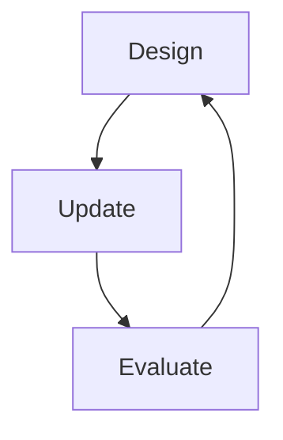

# Chapter 2 Notes

## When to be Bayesian
  - Most organisms are not Bayesian as it is expensive and a good model is required
    - Use heuristics that take adaptive shortcuts
    - In cases such as these, knowing which information to include and which to ignore makes rigorous Bayesian analysis unecessary

## Building a model

1. Design a model using scientific background - a data story
2. Bayesian update (only one estimator in Bayesian methods)
3. Evaluate - think about small world vs large world

## Terminology
- $p$ (proportion of blue marbles or earth's surface as water) is an example of a *parameter*
- The relative number of ways $p$ can produce the data is called the *likelihood*
- The probability of values of the parameter are known as the *prior probability*
- The updated plausibility of parameter values is called the *posterior probability*

### Example
- Throw an inflatable globe, is right index finger on water (W) or land (L)? Repeat nine times.
- Essentially trying to estimate the % of the Earth's surface that is covered in water.
-  Result is WLWWWLWLW
#### Model design
- How did the data arise? Observed - globe thrown, someone caught and finger position is random with respect to intent of thrower
- Some true proportion of water $p$
- So probabilty of observing water is $p$, where $p$ is proportion of Earth covered in water
- Assume toss is independent of other tosses
  - **book contains calculation that demonstrates autocorrelation is not present**
- What are the number of ways we can generate the observations we have seen?
#### Condition
- Bayesian updating defines optimal learning in small world, converts *prior* into *posterior* 
  - For each round of conditioning/updating, the prior is the posterior of the previous round
- Give model initial plausibility of each value of $p$
  - In this case, value between 0 and 1 assumed to be equally probable
- Condition on data to update information state - new confidence in each value of $p$ - dependent on the data

- Data order is irrelevant, because model assumes order irrelevant
- Sample size automatically embodied in posterior
  - Non-Bayesian inference relies on *asymptotic* behaviour so sample size is often important. Bayesian estimates are valid for any sample size, but their accuracy is dependent on the accuracy of the prior
#### Evaluate
- Model needs to be supervised
  - e.g. autocorrelation, experimental errors
- Posterior prediction checks
  - checking sensibility of model

### Construction Perspective
- Input: Joint prior - prior probability of the data and parameters. 
    - Sampling distribution is prior for the data and data is a part of the sampling distribution
- Output: Joint posterior - slicing off what has been ruled out

1. List variables and define generative relationships
  - $N$ number of tosses
  - $p$ true proportion of water
  - $W$ number of water
    ```mermaid
      graph TD;
          N-->W;
          p-->W;
    ```
  - Generatively, $N$ and $p$ cause $W$
  - Bayesian inference goes backwards - something has been caused, let's infer something about the causes
  - $N$ and $W$ have been observed
  
  - $W$
    - Given $N$ and $p$, what are the relative number of ways to see $W$
    - Binomial distribution describes this
    $$Pr(W|N,p) = \frac{N!}{W!(N-W)!}p^W(1-p)^{N-W}$$
      - probability of achieving an exact sequence given a binary choice $\times$ the number of ways to order the sequence (first bit with factorials - combinatorics)
      - Computing probability of our globe tosses using Julia
        ```
        using Distributions
        # 9 draws were made and probability of success is 0.5
        dist = Distributions.Binomial(9, 0.5)
        # Of the 9 draws, 6 were successful
        pdf(dist, 6)
        ```
  - $p$ - prior probability
    - We assumed flat prior, uniform distribution
    - $Pr(W)$ and $Pr(p)$ define prior predictive distribution
    - Huge literature on choice of prior
    - Flat prior conventional and bad
      - We always know something (before data) that can improve inference
      - No "true" prior, just need to do better than flat

  ## The Joint Model  
  - $W$ ~ Binomial($N$, $p$)
  - $p$ ~ Uniform($0$, $1$)
  
  ## Posterior Probability
  - Bayesian "estimate" is always posterior distribution over parameters, $Pr(parameters|data)$

  ### Bayes Theorem
  - Quick note - Bayesian analysis uses a broad view of probability rather than just using Bayes Theorem. Other statistica philosophies can use Bayes Theorem
  - Here, $Pr(p|W,N)$
    $$Pr(p|W,N) = \frac{Pr(W|N,p) \times Pr(p)}{\sum^p Pr(W|N,p) Pr(p)}$$
  - Compute using Bayes' Theorem
    - Just like the Garden of Forking data, this is multiplication of prior with the number of ways the data could arise, then normalising between 0 and 1 (sum of all products in numerator for all the values of the prior)
    - Technically normalisation not required, we're interested in the relative ways. But it's not too hard
    - Derivation
      - For an event B which is dependent on A, A and B will occur if A occurs then B occurs conditional on A
        $$P(A,B) = P(A) \times P(B|A)$$
      - This can be written for both A conditional on B and B conditional on A
        $$P(B|A) \times P(A) = P(A|B) \times P(B)$$
      - so 
        $$P(B|A) = \frac{P(A|B) \times P(B)}{P(A)}$$
      - P(A) is the average probability of the data (what is the probability of the data A)
        - Hence $P(A) = E(Pr(A) = \int Pr(A|B)P(B)db$. 
        - More simply:
          $$P(B|A) = \frac{P(A|B) \times P(B)}{\sum ^B P(A|B) \times P(B)}$$
    - Alternatively
      - $\frac{prior \times probability\ of\ the\ data}{average\ probability\ of\ the\ data} = posterior$
      - the probability of the data can be inferred as such:
        - Given the potential values of B, what is the probability of a potential value of A given the observed data?
        - That is, given the observed data A, what is the 

      
  ### Computing the posterior
  1. Analytical - small number of models can be done using this - integrals!
  2. Grid approximation (very intensive)
    - not very useful in general, good for teaching
  3. Quadratic approximation (limited)
  4. Markov Chain Monte Carlo (intensive)
    - second half of course. Growth of Bayesian attributed to nice Markov chain algorithms

## Grid Approximation
- Posterior is *standardised product* (add up all products and divide by sum) of:
1. Probability of the data
2. Prior probability

- Instead of infinite values of prior (integral), use *finite grid* of parameter space
- Too expensive with more than a few parameters
- Process
  1. Define the grid of parameter values (how many points to estimate posterior)
  2. Compute value of the prior at each parameter values on the grid
  3. Compute the likelihood at each parameter value
  4. Comute the unstandardised posterior at each parameter value, then standardise

## Quadratic Approximation
- For multiple parameters, grid approximation is expensive and is $O(grid\ points)^n$ where $n$ is the number of parameters
- Generally, peak of posterior can be estimated by a Gaussian, which has two parameters: mean and spread
- Logarithm of a Gaussian distribution forms a parabola, hence quadratic (i.e. we are estimating $log(posterior)$)
- Often exactly correct and computationally inexpensive
- Process:
    1. Find the posterior mode - optimisation algorithm climbs the posterior until it finds the peak
    2. Estimate the curvature near the peak. Curvature is sufficient to compute a quadratic approximation of the entire posterior
    - Uses Hessian or the second derivatives of the log of the posterior probability with respect to the parameters
      - since we know the centre (posterior mode) and second derivative, we can define the shape of the parabola as second derivative proportional to inverse square of the stddev
    - R function uses formula which defines probability of data and prior (two functions, one for W and one for p for examplt) and a list of data
- Assuming the posterior is Gaussian, the mean is x and the stddev is y

## MCMC
- In multi-level (mixed-effects) models:
  - hundreds to thousands of variables
  - inability to write a single, unified function for the posterior distribution, so difficult to maximise to find maximum a posteriori
  - Grid approximation will take to long to run
  - Special forms of quadratic approximation may work 
- MCMC can handle highly complex models
- MCMC does not compute or approximate the posterior, it samples the  posterior distribution. The frequency of the sampled values corresponds to the posterior plausbilities
