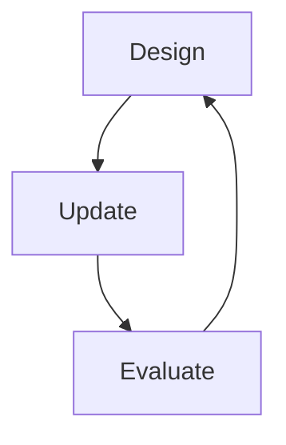

# Chapter 2 Notes

## Building a model

1. Design a model usign scientific background
2. Bayesian update (only one estimator in Bayesian methods)
3. Evaluate - think about small world vs large world

### Example
- Throw an inflatable globe, is right index finger on water (W) or land (L)? Repeat nine times.
- Essentially trying to estimate the % of the Earth's surface that is covered in water.
-  Result is WLWWWLWLW
#### Model design
- How did the data arise? Observed - globe thrown, someone caught and finger position is random with respect to intent of thrower
- Some true proportion of water $p$
- So probabilty of observing water is $p$, where $p$ is proportion of Earth covered in water
- Assume toss is independent of other tosses
  - **book contains calculation that demonstrates autocorrelation is not present**
- What are the number of ways we can generate the observations we have seen?
#### Condition
- Bayesian updating defines optimal learning in small world, converts *prior* into *posterior* 
  - For each round of conditioning/updating, the prior is the posterior of the previous round
- Give model initial plausibility of each value of $p$
  - In this case, value between 0 and 1 assumed to be equally probable
- Condition on data to update information state - new confidence in each value of $p$ - dependent on the data

- Data order is irrelevant, because model assumes order irrelevant
- Sample size automatically embodied in posterior
#### Evaluate
- Model needs to be supervised
  - e.g. autocorrelation, experimental errors
- Posterior prediction checks
  - checking sensibility of model

### Construction Perspective
- Input: Joint prior - prior probability of the data and parameters. 
    - Sampling distribution is prior for the data and data is a part of the sampling distribution
- Output: Joint posterior - slicing off what has been ruled out

1. List variables and define generative relationships
  - $N$ number of tosses
  - $p$ true proportion of water
  - $W$ number of water
    ```mermaid
      graph TD;
          N-->W;
          p-->W;
    ```
  - Generatively, $N$ and $p$ cause $W$
  - Bayesian inference goes backwards - something has been caused, let's infer something about the causes
  - $N$ and $W$ have been observed
  
  - $W$
    - Given $N$ and $p$, what are the relative number of ways to see $W$
    - Binomial distribution describes this
    $$Pr(W|N,p) = \frac{N!}{W!(N-W)!}p^W(1-p)^{N-W}$$
      - probability of achieving an exact sequence given a binary choice $\times$ the number of ways to order the sequence (first bit with factorials - combinatorics)
      - Computing probability of our globe tosses using Julia
        ```
        using Distributions
        # 9 draws were made and probability of success is 0.5
        dist = Distributions.Binomial(9, 0.5)
        # Of the 9 draws, 6 were successful
        pdf(dist, 6)
        ```
  - $p$ - prior probability
    - We assumed flat prior, uniform distribution
    - $Pr(W)$ and $Pr(p)$ define prior predictive distribution
    - Huge literature on choice of prior
    - Flat prior conventional and bad
      - We always know something (before data) that can improve inference
      - No "true" prior, just need to do better than flat

  ## The Joint Model  
  - $W$ ~ Binomial($N$, $p$)
  - $p$ ~ Uniform($0$, $1$)
  
  ## Posterior Probability
  - Bayesian "estimate" is always posterior distribution over parameters, $Pr(parameters|data)$

  ### Bayes Theorem
  - Here, $Pr(p|W,n)$
    $$Pr(p|W,n) = \frac{Pr(W|N,P) \times Pr(p)}{\sum^p Pr(W|N,p) Pr(p)}$$
  - Compute using Bayes' Theorem
    - Just like the Garden of Forking data, this is multiplication of prior with the number of ways the data could arise, then normalising between 0 and 1 (sum of all products in numerator for all the values of the prior)
    - Technically normalisation not required, we're interested in the relative ways. But it's not too hard
    - Derivation
      - For an event B which is dependent on A, A and B will occur if A occurs then B occurs conditional on A
        $$P(A,B) = P(A) \times P(B|A)$$
      - This can be written for both A conditional on B and B conditional on A
        $$P(B|A) \times P(A) = P(A|B) \times P(B)$$
      - so 
        $$P(B|A) = \frac{P(A|B) \times P(B)}{P(A)}$$
      - and where B has a distributed probability
      $$P(B|A) = \frac{P(A|B) \times P(B)}{\sum ^B P(A|B) \times P(B)}$$
    - Alternatively, prior times likelihood (data) = posterior
      
  ### Computing the posterior
  1. Analytical - small number of models can be done using this - integrals!
  2. Grid approximation (very intensive)
    - not very useful in general, good for teaching
  3. Quadratic approximation (limited)
  4. Markov Chain Monte Carlo (intensive)
    - second half of course. Growth of Bayesian attributed to nice Markov chain algorithms

## Grid Approximation
- Posterior is *standardised product* (add up all products and divide by sum) of:
1. Probability of the data
2. Prior probability
- Instead of infinite values of prior (integral), use *finite grid* of parameter space
- Too expensive with more than a few parameters

## Sampling from the posterior
- Incredibly useful to sample
  - Visualise uncertainty
  - Compute confidence intervals
  - Simulate observations
- MCMC produces only samples
- Easy to think about samples

### Recipe
1. Compute or approximate posterior
2. Sample with replacement from posterior
3. Compute stuff from samples

## Computing stuff
- Typically we construct intervals
  - How much posterior probability within an interval
  - What values return 80-90% posterior probability ('confidence interval')
  - What estimate of the parameter maximises posterior probability ('point estimates')
- Intervals and point estimates
  - Intervals of defined boundary - how much mass? (e.g. between $p$=0.25 and $p$=0.5)
  - Intervals of defined mass - which values? (e.g. lower, middle 80%)
- Percentile intervals (PIs)
  - Equal area in each tail (e.g. 50% - each tail contains 25% mass)
  - Good for symmetric distribution, may omit highest probability
- Highest posterior density interval (HDPI)
  - Narrowest interval containing mass specified (e.g. 50% HDPI contains highest density interval with 50% mass)
- Don't want point estimates
  - Entire posterior contains more information
  - "Best" point depends upon purpose
- Language around intervals
  - "Confidence interval"
    - non-Bayesian, misnomer
  - "Credible interval"
    - values are only credible if you trust data and model
  - "Compatability interval"
    - interval has values which are most compatible with data and model

## Predictive checks
  - Can use samples from posterior to simulate observations
  - Posterior predictive distribution
  - Example
    - Based on different values of $p$, we can generate different sampling distributions that show how likely a certain number of successes would be given a particular value of $p$
    - We want something that weights these and merges them to give a single dataset
 
    - Random Binomial -> 10,000 points, 9 tosses, samples from posterior distribution
  - Gets harder with more complicated models
